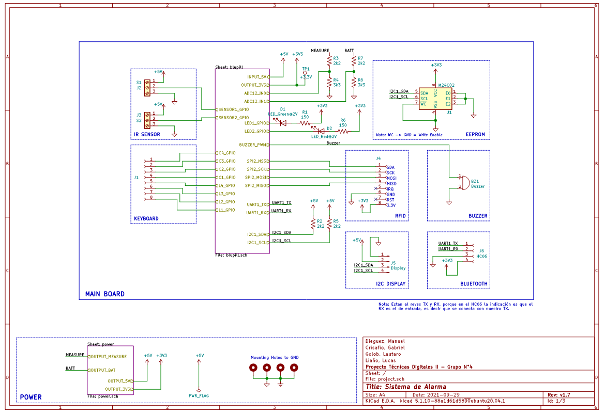

<!-- Badged -->
[](https://github.com/lucasliano/td2project)
[](https://github.com/lucasliano/td2project)
[](https://github.com/lucasliano/td2project)
[](https://github.com/lucasliano/td2project)


> :warning: **Work In Progress** :warning:


<!-- PROJECT LOGO -->
<br />
<p align="center">
  <a href="https://github.com/lucasliano/td2project">
    
  </a>

  <h3 align="center">Security Alarm System</h3>
  
  <p align="center">
    This security system project is the final assignment of the digital technics II subjects at Universidad Tecnológica Nacional.
    <br />
    <a href="https://github.com/lucasliano/td2project"><strong>Explore the docs »</strong></a>
    <br />
    <br />
    <a href="https://github.com/lucasliano/td2project">View Demo</a>
    ·
    <a href="https://github.com/lucasliano/td2project/issues">Report Bug</a>
    ·
    <a href="https://github.com/lucasliano/td2project/issues">Request Feature</a>
  </p>
</p>

<!-- TABLE OF CONTENTS -->
<details open="open">
  <summary><h2 style="display: inline-block">Table of Contents</h2></summary>
  <ol>
    <li>
      <a href="#about-the-project">About The Project</a>
      <ol>
      <li><a href="#system-diagram">System Diagram</a></li>
      <li><a href="#main-board-pcb-and-schematics">Main Board PCB and Schematics</a></li>
      <li><a href="#equipment">Equipment</a></li>
    </ol>
    </li>
    <li><a href="#authors">Authors</a></li>
    <li><a href="#license">License</a></li>
    <li><a href="#contact">Contact</a></li>
  </ol>
</details>


## About The Project

The main idea of this project is to build a systems which allows you to detect motion in different zones within your home.  

The activation/deactivation of the system is meant to be controlled using an android app or directly trough the front keyboard. At the same time, it would be possible to configure the system to deactivate the alarm in presence of a known RFID card.

Should an error occurred, a notification will be sent to the mobile device and it will be logged into the internal EEPROM memory. The system also takes into account possible disconnections from the power supply. 

#### System Diagram
<p align="center">
  <a href="https://github.com/lucasliano/td2project">
    
  </a>
</p>

#### Memory Map
This section describes the EEPROM memory organization. Each section provides critical information to the system. All the registers stored in the _Logs Block_ will be available through the android app.

<p align="center">
  <a href="https://github.com/lucasliano/td2project">
    
  </a>
</p>


### Main Board PCB and Schematics

#### Schematics
The main board includes a battery charger and power supply source administrator. You will find this schematic in a PDF file in the ``` PCB_files_kicad ``` folder.

<p align="center">
  <a href="https://github.com/lucasliano/td2project/blob/main/PCB/Schematic%20v1.7.pdf">
    
  </a>
</p>

#### PCB
<p align="center">
  <a href="https://github.com/lucasliano/td2project/tree/main/PCB/project">
    
  </a>
</p>

<!-- Authors -->
## Authors
* Liaño, Lucas
* Dieguez, Manuel
* Golob, Lautaro Francisco
* Crisafio, Gabriel


<!-- LICENSE -->
## License

Distributed under the GPL-3.0 License. See `LICENSE` for more information.

<!-- CONTACT -->
## Contact

Lucas Liaño - lliano@frba.utn.edu.ar

Repo Link: [https://github.com/lucasliano/td2project](https://github.com/lucasliano/td2project)
